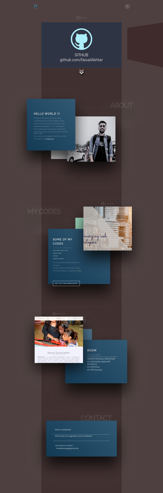

# A Dev Portfolio

<u>Refreshed and Updated</u>

## Sections covered
- [x] About
- [x] My Codes
- [x] Some Projects
- [x] Contact

Click ~here~ to go to the portfolio.

## Techstack

### Web Interface

### External Libraries
1. Swiper
  - [swiper-JS](js/swiper.jquery.min.js)
  - [swiper-CSS](css/swiper.min.css)
1. [Scroll Reveal](js/scrollreveal.min.js)
1. jQuery
  - [jquery](js/jquery.min.js)
  - [jquery Parallax scroll](js/jquery.parallax-scroll.js)
  - [jquery mousewheel](js/jquery.mousewheel.min.js)
1. [Anchors](js/anchors.nav.js)

## Contributing

Pull requests are welcome. For major changes, please open an issue first to discuss what you would like to change.

## Contributors

<table>
  <tr>
    <td align="center">
      <a href="http://faisalakhtar.github.io">
        
         
        <b>Faisal Akhtar</b>
      </a>
       
      <a title="Code">💻</a>
      <a title="Design">🎨</a>
      <a title="Documentation">📖</a>
      <a title="Maintenance">🚧</a>
    </td>
    <td align="center">
      <a href="http://goyalshubhangi.github.io">
        
         
        <b>Shubhangi Goyal</b>
      </a>
       
      <a title="Code">💻</a>
      <a title="Design">🎨</a>
    </td>
  </tr>
</table>

## Licensing

All scripts, stylesheets, markups and design implementations are distributed under the [MIT](LICENSE) license.
